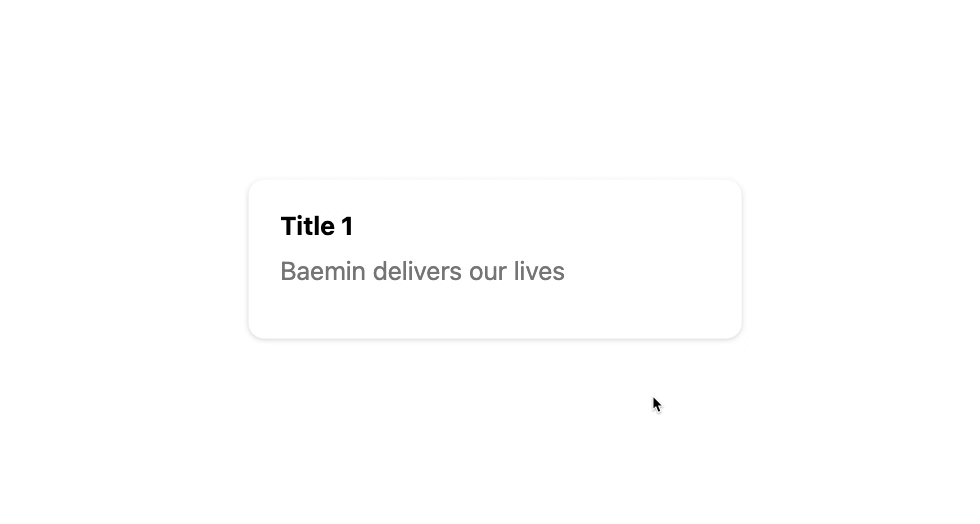
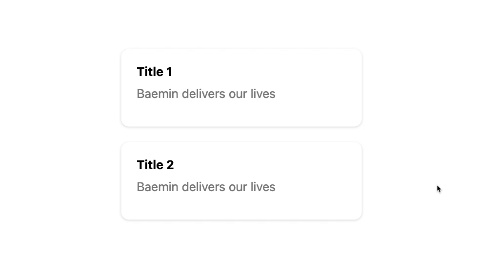

# 드래그 앤 드롭 애니메이션

이 문서에서는 [HTML Drag and Drop API](https://developer.mozilla.org/en-US/docs/Web/API/HTML_Drag_and_Drop_API)를 사용하지 않고 드래그 앤 드롭을 애니메이션과 함께 구현하는 방법에 대해 기술합니다.

해당 문서에서 사용하는 기술력과 로직은 현재까지의 지식에 기반합니다. 이것이 정답은 아니며 여러분은 얼마든지 더 나은 방법을 떠올릴 수 있습니다.

> 모든 코드와 개발 과정을 설명하기엔 너무 복잡하기 때문에 일부 코드 조각과 컨셉, 그리고 힌트만 전달합니다.

## 애니메이션

드래그 앤 드롭으로 HTML 요소를 교체하는 작업은 어렵지 않습니다. 하지만 그 변화가 일어날 때 이전 상태와 다음 상태를 부드럽게 연결짓는 것은 전혀 다른 차원의 문제죠.

DOM을 삽입, 제거, 교체할 때에는 즉각적인 변화가 일어납니다. 이 즉각적인 변화를 컨트롤하는 것이 핵심입니다. 각 과정에서 상태 변화를 어떻게 컨트롤 할 수 있는지 설명합니다.

## 이벤트

이벤트 활용에는 변경할 DOM에 직접적으로 리스너를 등록하는 방법과 이벤트 위임을 사용하는 방법 두 가지가 있습니다.

이벤트 위임은 이벤트 발생 대상의 상위 요소에 이벤트 리스너를 부착하고 이벤트 타겟을 구분하여 콜백을 실행하는 방식입니다. 하위 트리의 요소가 동적으로 변하거나 그 개수가 많아질 가능성이 높을 때 리스너 부착 오버헤드를 낮추고 메모리를 절약할 수 있어 유리합니다.

두 방법 모두 장단점이 있으며 자신의 애플리케이션 구조에 적합한 방법을 선택합니다.

다음의 이벤트들을 사용하여 드래그 앤 드롭을 구현합니다.

**마우스 포인터 디바이스**

- `mousedown`
- `mousemove`
- `mouseup`
- `mouseenter`

**터치 디바이스**

- `touchstart`
- `touchmove`
- `touchend`

**유니버설 (Pointer Events)**

- `pointerdown`
- `pointermove`
- `pointerup`
- `pointerenter`

> Pointer Events를 사용하면 마우스 포인터 디바이스와 터치 디바이스의 동시 개발이 가능합니다.

**트랜지션**

- `transitionstart`
- `transitionend`

---

## 드래그



### DOM 복제

[**드래그 앤 드롭 API**](https://developer.mozilla.org/en-US/docs/Web/API/HTML_Drag_and_Drop_API) 없이 드래그 중인 요소를 화면에 표현하는 방법은 생각보다 간단합니다. 드래그할 요소와 똑같이 생긴 요소를 화면에 추가하고 움직이는 것이죠.


```js
const ghostNode = targetNode.cloneNode(true)

document.body.appendChild(ghostNode)
```

Node의 [`cloneNode`](https://developer.mozilla.org/en-US/docs/Web/API/Node/cloneNode) 메소드는 Node와 동일한 구조의 새로운 Node를 복제합니다.

> ⚠️ 함수의 첫 번째 인자로 `true`를 전달하면 하위 트리까지 똑같이 복제합니다.

> ⚠️ 복제된 Node는 원본 Node와 레퍼런스가 다릅니다.

복제된 DOM은 마우스 포인터와 함께 화면상에서 이동해야하므로 그 위치는 절대적이어야 하며, 시작 위치는 드래그 대상 DOM의 화면에서의 상대적 위치입니다. 높게 설정된 `z-index`는 드래그 중인 요소를 그 어떤 요소보다 Z 축 기준으로 가장 위에 놓이게 하여 화면에서 가려지지 않게 합니다.

```js
const { top, left } = targetNode.getBoundingClientRect()

ghostNode.style.position = `fixed`
ghostNode.style.top = `${top}px`
ghostNode.style.left = `${left}px`
ghostNode.style.zIndex = `9999` # 또는 더 큰 수
```

> 시작점 위치는 DOM 이동 시 거리 계산을 위해 기억해둡니다.

```js
const originalTop = top
const originalLeft = left
```

**애니메이션**

복제된 DOM이 화면에 표시된 후 상태 변화와 **transition**을 사용해 애니메이션을 발동합니다.

```js
ghostNode.style.transition = `transform 200ms ease, box-shadow 200ms ease`
ghostNode.style.transform = `scale(1.03)`
ghostNode.style.boxShadow = `0 30px 60px rgba(0, 0, 0, .3)`
```

> inner style 대신 CSS의 class에 스타일을 정의한 후 class를 추가하는 방법도 있습니다.

### 원본 요소 가리기

**Placeholder**

드래그 대상이었던 원본 요소는 여전히 제자리에 있지만 그 역할은 공간 차지뿐입니다. 모든 내용은 이동중인 `ghostNode`에 복제되었으므로 원본의 내용은 보이지 않게 처리합니다. 우리는 복제된 후의 원본 요소를 **placeholder** 라고 부릅니다.

> 다양한 방법을 사용하여 내부 컨텐츠를 제거해보세요.

### 이동

드래그할 DOM과 똑같이 생긴 복제된 DOM을 이동시킬 차례입니다. 시작점과 현재 위치의 차이만큼 시작점에 더한 값이 이동해야할 위치입니다.

```js
window.addEventListener('pointermove', (e) => {
  const offsetX = e.pageX - initialX
  const offsetY = e.pageY - initialY

  const toX = originalLeft + offsetX
  const toY = originalTop + offsetY

  ghostNode.style.left = `${toX}px`
  ghostNode.style.top = `${toY}px`
})
```

### 위치 파악

드래그 중인 요소가 다른 요소를 만났을 때 그 위치로 placeholder가 이동해야합니다. 다른 요소를 찾는 방법에는 두 가지가 있습니다.

1. `event.target.closest`
2. `document.elementAtPoint.closest`

`closest(selector)`는 메소드를 발동시킨 요소를 **포함**하여 HTML 트리를 타고 올라가며 가장 먼저 `selector`에 해당하는 요소를 반환합니다. 해당하는 요소가 없을 경우 `null`을 반환합니다.

**1번** 방식은 마우스 포인터에 위치한 요소만 찾을 수 있습니다. **2번** 방식은 화면상의 임의의 위치에서 요소를 찾을 수 있습니다.

> 이벤트 타겟과 `elementAtPoint` 메소드의 반환 요소는 항상 HTML 트리의 가장 아래에 위치한 노드입니다.

### 위치 변경

**애니메이션**

만약 애니메이션이 없다면 DOM 교체로 위치를 쉽게 바꿀 수 있습니다. 하지만 애니메이션 개발은 전혀 다른 방법을 사용합니다. **_애니메이션이 발동하는 순간에 DOM 트리 구조는 그대로입니다._** 단지 `transform`을 사용하여 현재 상태와 다음 순간의 상태를 부드럽게 전환시킬 뿐이죠.

이동해야할 거리(distance)는 드래그 중인 요소와 이 요소가 포함하는 수직 방향의 마진(주변으로의 빈 공간)을 더한 값입니다.

```js
const distance = targetNodeHeight + targetNodeVerticalMargin

cards.forEach((card) => {
  card.style.transform = `translate3d(0, ${distance}px, 0)`
})
```

> 몇 개의 요소들이 어떤 방향으로 이동해야 하는지에 대해 고민해보면 재미있습니다.



## 드롭

드롭의 순간에서 최종적으로 DOM을 교체하는 동시에 애니메이션이 적용된 모든 요소들의 스타일을 제거합니다.

```js
column.insertBefore(toNode, targetNode)

cards.forEach((card) => {
  card.removeAttribute('style')
})
```

**되돌아가기 애니메이션**

```js
ghostNode.style.transition = `top 200ms ease, left 200ms ease`
ghostNode.style.top = `${toTop}px`
ghostNode.style.left = `${toLeft}px`
```

애니메이션과 DOM 조작은 순차적으로 일어나야합니다. 되돌아가기 애니메이션이 추가된다면 DOM 교체의 작업도 애니메이션이 끝난 후에 이루어져야 하죠.

```js
ghostNode.addEventListener('transitionend', function t() {
  ...
  // DOM 교체
  ...
  ghostNode.removeEventListener('transitionend', t)
})
```
